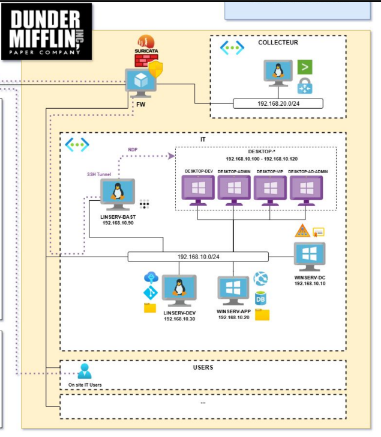
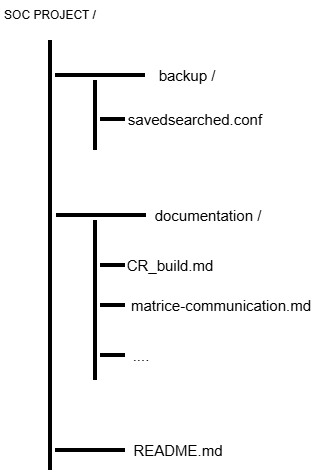

# SOC : CR du build

#### VENAULT Maxime

#### HAMEAU Quentin

#### BOUYDRON Nicolas

#### SIBONI-BERGARD Maxence

## Archictecture du build

## Architecture du client

## Architecture du projet

 

## Règles implémentées

### ASREP-Roasting

### Access LSASS Memory for Dump Creation

### Action sur la clé de registre Run

### Check for High-Frequency C2 Communication

### Check for Periodic Beaconing Behavior

### Creation of lsass Dump with Taskmgr

### Création ou modification de tâche planifiée

### Création service suspect

### Création tâche planifiée suspicieuse

### DUMP LSASS

### Detect Distributed Password Spray Attempts

### Detect Password Spray Attempts

### Detection: Kerberos Pre-Authentication Flag Disabled in UserAccountControl

### Detection: Kerberos Pre-Authentication Flag Disabled with PowerShell

### Dump LSASS

### Dump LSASS via comsvcs DLL

### Dump LSASS via procdump

### Internal Horizontal Port Scan

### Internal Vertical Port Scan

### Internal Vertical Port Scan - simple

### Kerberoasting

### Kerberoasting spn request with RC4 encryption

### Linux Auditd Find Credentials From Password Managers

### Linux Auditd Find Credentials From Password Stores

### Linux Auditd Possible Access To Credential Files

### Linux Auditd Sudo Or Su Execution

### Linux Password looting

### Linux System Network Discovery

### Malware Registry Abuses

### Modification clé registre RUN

### Reg exe Manipulating Windows Services Registry Keys

### Registry Keys Used For Persistence

### Registry key modifications

### Rubeus Command Line Parameters

### Scan réseau (port ou ip)

### Suspicious HTTP traffic that may be indicative of a beaconing attempt

### Suspicious Linux Discovery Commands

### Test - Création de tâche planifiée Windows

### Utilisation de LSASS 

### Windows AD Suspicious Attribute Modification

### Windows Hidden Schedule Task Settings

### Windows Possible Credential Dumping

### Windows PowerShell ScheduleTask

### Windows Scheduled Task Created Via XML

### Windows Scheduled Task with Suspicious Command

### Windows Service Created with Suspicious Service Name2

### Windows Service Created with Suspicious Service Path

### Windows Service Creation Using Registry Entry

### Windows Terminating Lsass Process

### cat /etc/passwd

### enumération
